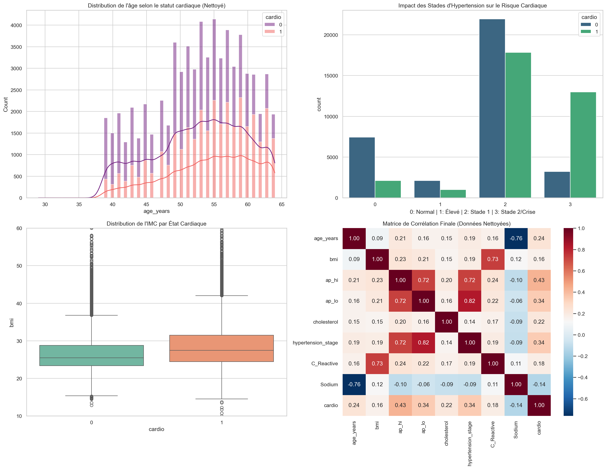
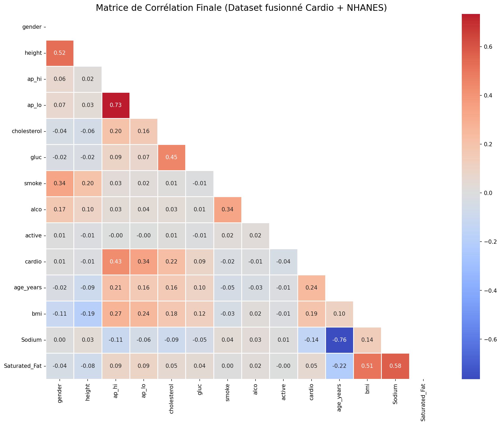
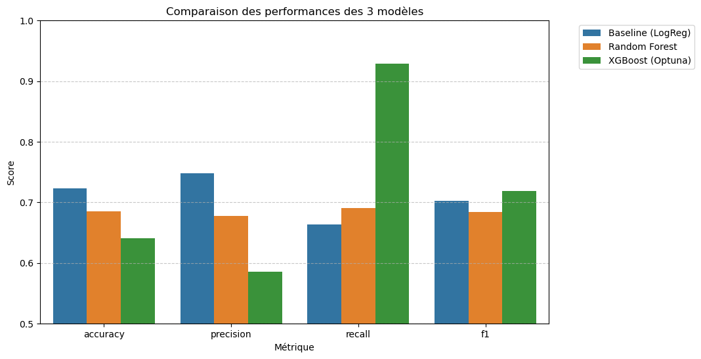
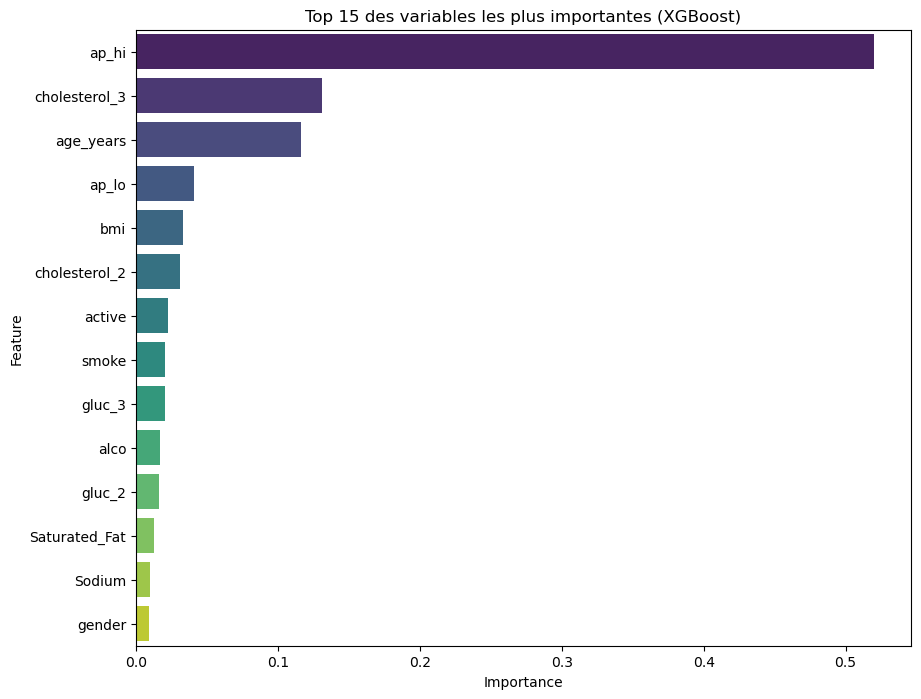

# Assignment 4 — Visualisation des données et des performances

## 1. Visualisation des données brutes

**Notebook :** `notebooks/exploration_data.ipynb`  
**Pour générer :** Exécuter toutes les cellules du notebook. Le fichier est sauvegardé dans `plot/donnees_brutes.png`.

### Distribution de l'âge par statut cardiaque (histogramme empilé)
- **Objectif :** Identifier si l'âge est un facteur discriminant du risque cardiovasculaire.
- **Choix du graphique :** Histogramme empilé pour visualiser la distribution et la superposition des deux classes.
- **Interprétation :** Les patients malades (cardio=1) sont majoritairement concentrés entre 50 et 65 ans. La séparation des distributions confirme que l'âge est une variable prédictive pertinente.

### Répartition des stades d'hypertension (countplot)
- **Objectif :** Mesurer l'impact du niveau de pression artérielle sur le diagnostic.
- **Choix du graphique :** Countplot groupé pour comparer les effectifs sains/malades par stade.
- **Interprétation :** Les patients au stade 2/Crise (stade 3) sont majoritairement malades. À l'inverse, les patients normotendus (stade 0) sont en grande majorité sains. La pression artérielle est le facteur le plus discriminant.

### Distribution de l'IMC par état cardiaque (boxplot)
- **Objectif :** Vérifier si un IMC élevé est lié au risque cardiaque.
- **Choix du graphique :** Boxplot pour comparer les distributions et détecter les outliers.
- **Interprétation :** Les patients malades ont un IMC médian légèrement supérieur aux patients sains, confirmant le surpoids comme facteur de risque, bien que la discrimination soit moins nette que pour l'âge ou la pression.

### Matrice de corrélation initiale (heatmap)
- **Objectif :** Détecter les redondances entre variables avant sélection.
- **Choix du graphique :** Heatmap annotée pour lire d'un coup d'œil toutes les corrélations.
- **Interprétation :** `ap_hi` et `hypertension_stage` sont très fortement corrélés (> 0.8), de même que `weight` et `bmi`. Ces redondances justifient la suppression de variables dans l'étape suivante.

**Pertinence pour le projet :** Ces visualisations permettent de valider que les variables choisies sont bien liées au risque cardiovasculaire et de justifier les choix de feature engineering.

---

## 2. Visualisation après feature engineering

**Notebook :** `notebooks/preprocessing.ipynb`  
**Pour générer :** Exécuter toutes les cellules du notebook. Le fichier est sauvegardé dans `plot/feature_engineering.png`.

### Matrice de corrélation après nettoyage (heatmap)
- **Objectif :** Vérifier que les variables redondantes ont bien été supprimées.
- **Choix du graphique :** Heatmap avec masque triangulaire pour éviter la redondance visuelle.
- **Interprétation :** Après suppression de `weight`, `C_Reactive`, `pulse_pressure` et `hypertension_stage`, la multicolinéarité est réduite. Les variables restantes (`ap_hi`, `age_years`, `bmi`, `cholesterol`) sont modérément corrélées à la cible `cardio` sans être redondantes entre elles.

**Pertinence pour le projet :** Confirme que le dataset final est propre et que les features sélectionnées apportent chacune une information indépendante au modèle.

---

## 3. Visualisation des performances des modèles

**Notebook :** `notebooks/modelling.ipynb`  
**Pour générer :** Exécuter toutes les cellules du notebook. Les fichiers sont sauvegardés dans `plot/`.

### Comparaison des métriques (barplot)

- **Objectif :** Comparer objectivement Régression Logistique, Random Forest et XGBoost.
- **Choix du graphique :** Barplot groupé par métrique pour lire les écarts en un coup d'œil.
- **Interprétation :** XGBoost atteint un rappel de 92,3 % contre 66,4 % pour la baseline. En contrepartie, sa précision est plus faible (58,6 %). Ce compromis est acceptable dans un contexte médical où manquer un patient malade est plus grave que déclencher une fausse alerte.

### Importance des variables XGBoost

- **Objectif :** Comprendre quelles variables le modèle utilise le plus.
- **Choix du graphique :** Barplot horizontal trié par importance décroissante.
- **Interprétation :** La pression systolique (`ap_hi`), l'âge et le cholestérol sont les trois variables les plus déterminantes — ce qui est cohérent avec la littérature médicale sur les MCV.

**Pertinence pour le projet :** Ces trois visualisations forment un tableau de bord complet : le barplot compare les modèles, le graphique d'âge valide la cohérence médicale des prédictions, et l'importance des variables assure l'explicabilité du modèle retenu.

---

## Localisation des notebooks et exécution

| Fichier | Rôle | Commande |
|---|---|---|
| `notebooks/exploration_data.ipynb` | Visualisation des données brutes | Ouvrir avec Jupyter et Run All |
| `notebooks/preprocessing.ipynb` | Visualisation après feature engineering | Ouvrir avec Jupyter et Run All |
| `notebooks/modelling.ipynb` | Entraînement et performances | Ouvrir avec Jupyter et Run All |
